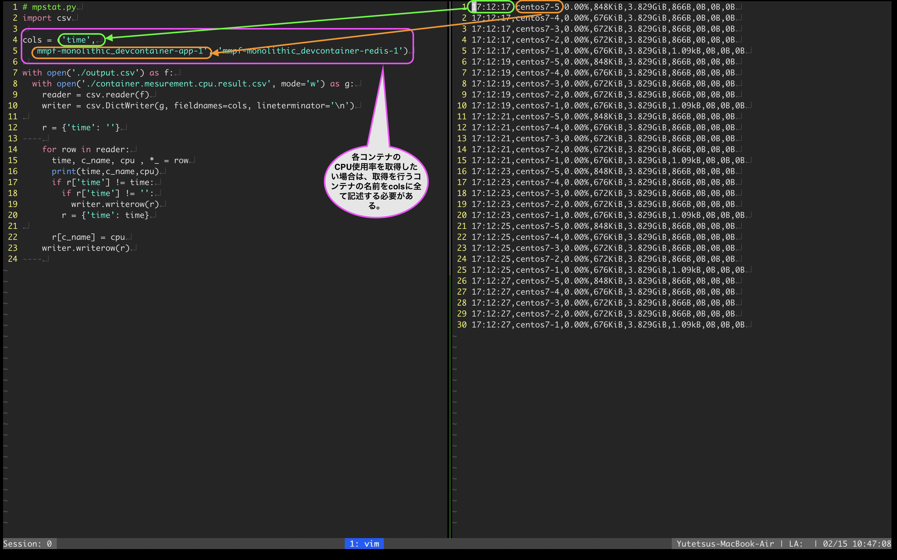

# コンテナ毎のCPU使用率、メモリ使用率のメトリクスをグラフ化する手順

## 前提条件
- 今回はダミーのコンテナイメージ(centos7)を複数起動してメトリクスを採取を行うが、実際の運用ではmmpfのコンテナ(mmpf.server,redis)が対象となる。

## 検証手順
```sh
# 適当に複数のコンテナを稼働させる。今回はcentos7のイメージ使い、centosのイメージを焼いたコンテナを5個稼働させる
# bashの場合はこちらのフォーマットで記述してください → $ for i in {1..5}; <command>; done 
$ for i in {1..5}; do docker run -it -d --name centos7-${i} centos:centos7 ; done
03b9aef2d722b22cfd27f73b8b7c7a37f58d143ed5f51d18735984ab2997016b
735046eaeef06307da9bfb580fdebad8412503359e59f5367ec3daebc704c638
e93fa7d2756883214c4c3ea5083b54be1241eab4d7ed5eb472c0a17173e760fa
d758f3f7e3531f48382c8463e34cc7e56e1d3a65b3d19c280ca90e3686032d77
25c3acfccf6db19c72ae59c0b5ee995b12240770b708665e8813c6d5b6ddbd5e

# 5個cenos7のコンテナが起動したことを確認する
$ docker ps
CONTAINER ID   IMAGE            COMMAND       CREATED         STATUS         PORTS     NAMES
25c3acfccf6d   centos:centos7   "/bin/bash"   6 seconds ago   Up 5 seconds             centos7-5
d758f3f7e353   centos:centos7   "/bin/bash"   7 seconds ago   Up 5 seconds             centos7-4
e93fa7d27568   centos:centos7   "/bin/bash"   7 seconds ago   Up 5 seconds             centos7-3
735046eaeef0   centos:centos7   "/bin/bash"   7 seconds ago   Up 6 seconds             centos7-2
03b9aef2d722   centos:centos7   "/bin/bash"   8 seconds ago   Up 6 seconds             centos7-1
```
`container_metrics_exporter.sh` で稼働しているコンテナのメトリクスをcsvとして取得する
```sh
$ ./container_metrics_exporter.sh
```
shellの実装都合で、内部で無限ループを行い、docker statsコマンドを叩いているため、程よいタイミングで`SIGINT`(CTRL + C)させる
<details>

<summary>デフォルトではoutput.csvとして出力される</summary>

```csv
17:12:17,centos7-5,0.00%,848KiB,3.829GiB,866B,0B,0B,0B
17:12:17,centos7-4,0.00%,676KiB,3.829GiB,866B,0B,0B,0B
17:12:17,centos7-3,0.00%,672KiB,3.829GiB,866B,0B,0B,0B
17:12:17,centos7-2,0.00%,672KiB,3.829GiB,866B,0B,0B,0B
17:12:17,centos7-1,0.00%,676KiB,3.829GiB,1.09kB,0B,0B,0B
17:12:19,centos7-5,0.00%,848KiB,3.829GiB,866B,0B,0B,0B
17:12:19,centos7-4,0.00%,676KiB,3.829GiB,866B,0B,0B,0B
17:12:19,centos7-3,0.00%,672KiB,3.829GiB,866B,0B,0B,0B
17:12:19,centos7-2,0.00%,672KiB,3.829GiB,866B,0B,0B,0B
17:12:19,centos7-1,0.00%,676KiB,3.829GiB,1.09kB,0B,0B,0B
17:12:21,centos7-5,0.00%,848KiB,3.829GiB,866B,0B,0B,0B
17:12:21,centos7-4,0.00%,676KiB,3.829GiB,866B,0B,0B,0B
17:12:21,centos7-3,0.00%,672KiB,3.829GiB,866B,0B,0B,0B
17:12:21,centos7-2,0.00%,672KiB,3.829GiB,866B,0B,0B,0B
17:12:21,centos7-1,0.00%,676KiB,3.829GiB,1.09kB,0B,0B,0B
17:12:23,centos7-5,0.00%,848KiB,3.829GiB,866B,0B,0B,0B
17:12:23,centos7-4,0.00%,676KiB,3.829GiB,866B,0B,0B,0B
17:12:23,centos7-3,0.00%,672KiB,3.829GiB,866B,0B,0B,0B
17:12:23,centos7-2,0.00%,672KiB,3.829GiB,866B,0B,0B,0B
17:12:23,centos7-1,0.00%,676KiB,3.829GiB,1.09kB,0B,0B,0B
17:12:25,centos7-5,0.00%,848KiB,3.829GiB,866B,0B,0B,0B
17:12:25,centos7-4,0.00%,676KiB,3.829GiB,866B,0B,0B,0B
17:12:25,centos7-3,0.00%,672KiB,3.829GiB,866B,0B,0B,0B
17:12:25,centos7-2,0.00%,672KiB,3.829GiB,866B,0B,0B,0B
17:12:25,centos7-1,0.00%,676KiB,3.829GiB,1.09kB,0B,0B,0B
17:12:27,centos7-5,0.00%,848KiB,3.829GiB,866B,0B,0B,0B
17:12:27,centos7-4,0.00%,676KiB,3.829GiB,866B,0B,0B,0B
17:12:27,centos7-3,0.00%,672KiB,3.829GiB,866B,0B,0B,0B
17:12:27,centos7-2,0.00%,672KiB,3.829GiB,866B,0B,0B,0B
17:12:27,centos7-1,0.00%,676KiB,3.829GiB,1.09kB,0B,0B,0B
```
</details>

このままでは、CPU使用率及び、メモリ使用率をグラフで可視化できないため、下記のpythonスクリプトを実行し、グラフ出力をおこえるようにする

この時pythonスクリプトの都合上、csvから取得を行いたいコンテナの名前をcols()に記述しなくてはいけない。


```sh
$ python3 ../python3/container_mesurement_cpu_usage.py
$ python3 ../python3/container_mesurement_memory_usage.py
```
あとは、Excel上でcsvデータを全選択し、任意のグラフで可視化する

検証が終了したので、全コンテナを停止(一つでの稼働させたいコンテナがある場合はこのコマンドは使わないようする)して、削除する
```sh
$ docker stop $(docker ps -a -q)
25c3acfccf6d
d758f3f7e353
e93fa7d27568
735046eaeef0
03b9aef2d722

$ docker rm $(docker ps -a -q)
25c3acfccf6d
d758f3f7e353
e93fa7d27568
735046eaeef0
03b9aef2d722
```